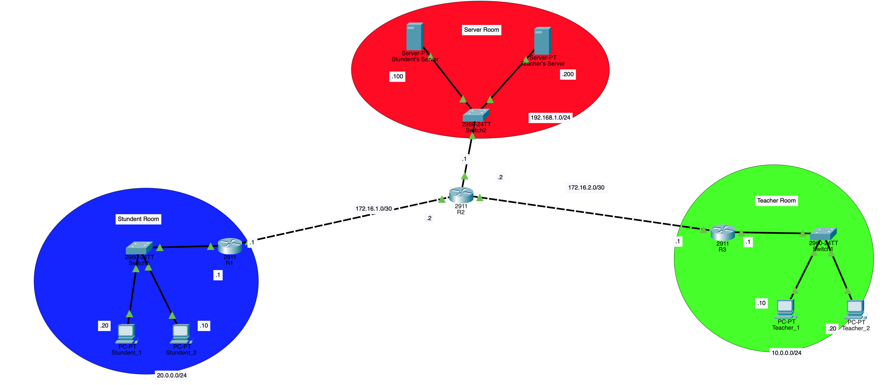

# School Network Access Control (ACL + OSPF)

A Cisco Packet Tracer project implementing a segmented school network where **Students** and **Teachers** each get access only to their own server, enforced with Extended ACLs, and tied together with **OSPF** dynamic routing.



## Overview

The goal was to build a school network with role-based restricted access: Students should reach the **Student Server**, Teachers should reach the **Teacher Server**, and nothing else — controlled entirely with Extended Access Control Lists. OSPF handles the dynamic routing between all three network segments, which are joined by a central router.

**Network layout:**

| Segment | Subnet | Devices |
|---|---|---|
| Student Room (behind `StudentRouter`) | `20.0.0.0/24` | 2 student PCs |
| Teacher Room (behind `TeacherRouter`) | `10.0.0.0/24` | 2 teacher PCs |
| Server Room (behind central `Router`) | `192.168.1.0/24` | Student Server (`.100`), Teacher Server (`.200`) |
| StudentRouter ↔ central Router | `172.16.1.0/30` | point-to-point link |
| TeacherRouter ↔ central Router | `172.16.2.0/30` | point-to-point link |

Point-to-point links between routers use a `/30` mask; local LANs and server segments use `/24`.

## Objectives / Skills Demonstrated

- Static IP addressing and subnetting (`/24` for LANs, `/30` for router links)
- Dynamic routing with **OSPF** (single area, wildcard masks)
- **Extended ACLs** for role-based, protocol-specific traffic filtering (HTTP + ICMP)
- Verifying reachability and access restrictions from the CLI

## Configuration Walkthrough

### 1. Addressing
Each router was given a descriptive hostname (`Router`, `StudentRouter`, `TeacherRouter`), and static IPs/subnet masks were assigned to every PC, with the local interface set as each PC's default gateway so hosts could also reach devices outside their own LAN.

| Device | Interface | IP Address |
|---|---|---|
| StudentRouter | Gi0/0 | `20.0.0.1/24` |
| StudentRouter | Gi0/1 | `172.16.1.1/30` |
| Router (central) | Gi0/0 | `192.168.1.1/24` |
| Router (central) | Gi0/1 | `172.16.1.2/30` |
| Router (central) | Gi0/2 | `172.16.2.2/30` |
| TeacherRouter | Gi0/0 | `10.0.0.1/24` |
| TeacherRouter | Gi0/1 | `172.16.2.1/30` |

### 2. Dynamic Routing — OSPF
Each router was brought into OSPF process 1, advertising its directly connected networks with the appropriate wildcard mask:

```
router ospf 1
 network <network-ip> <wildcard-mask> area 0
```

- `/30` links → wildcard mask `0.0.0.3`
- `/24` networks → wildcard mask `0.0.0.255`

`show ip ospf neighbor` confirmed full adjacencies between the central router and both `StudentRouter` and `TeacherRouter`.

### 3. Extended ACLs
Two Extended ACLs enforce the access policy — one per edge router, applied to traffic sourced from each LAN:

**`STUDENT_POLICY`** (on `StudentRouter`):
```
permit tcp 20.0.0.0 0.0.0.255 host 192.168.1.100 eq www
permit icmp 20.0.0.0 0.0.0.255 host 192.168.1.100 echo
deny tcp 20.0.0.0 0.0.0.255 host 192.168.1.200 eq www
deny icmp 20.0.0.0 0.0.0.255 host 192.168.1.200 echo
permit ip any any
```

**`TEACHER_POLICY`** (on `TeacherRouter`):
```
permit tcp 10.0.0.0 0.0.0.255 host 192.168.1.200 eq www
permit icmp 10.0.0.0 0.0.0.255 host 192.168.1.200 echo
permit icmp 10.0.0.0 0.0.0.255 host 192.168.1.100 echo
deny tcp 10.0.0.0 0.0.0.255 host 192.168.1.100 eq www
permit ip any any
```

The trailing `permit ip any any` on each list is deliberate — it ensures the explicit `deny` rules only affect the traffic they target, without blocking any other, unrelated traffic that might be added later.

### 4. Verification
Confirmed that both students and teachers could only browse the website hosted on their own server — any other combination returned a `Request Timeout` in the browser. Via `ping`, both groups could reach their own server successfully; teachers could additionally ping the student server without error (ICMP is permitted both ways for teachers), even though HTTP access to it remains blocked.

## Result — Access Matrix

| Source | Destination | HTTP (port 80) | ICMP (ping) |
|---|---|---|---|
| Students (`20.0.0.0/24`) | Student Server (`.100`) | ✅ | ✅ |
| Students (`20.0.0.0/24`) | Teacher Server (`.200`) | ❌ | ❌ |
| Teachers (`10.0.0.0/24`) | Teacher Server (`.200`) | ✅ | ✅ |
| Teachers (`10.0.0.0/24`) | Student Server (`.100`) | ❌ | ✅ |

## Files in This Folder

| File | Description |
|---|---|
| `ACL.pkt` | Cisco Packet Tracer topology file |
| `topology.png` | Network diagram |

## How to Open

1. Install [Cisco Packet Tracer](https://www.netacad.com/courses/packet-tracer) (free with a Cisco Networking Academy account).
2. Download `ACL.pkt` from this folder.
3. Open it directly in Packet Tracer to explore the topology and device configs.
