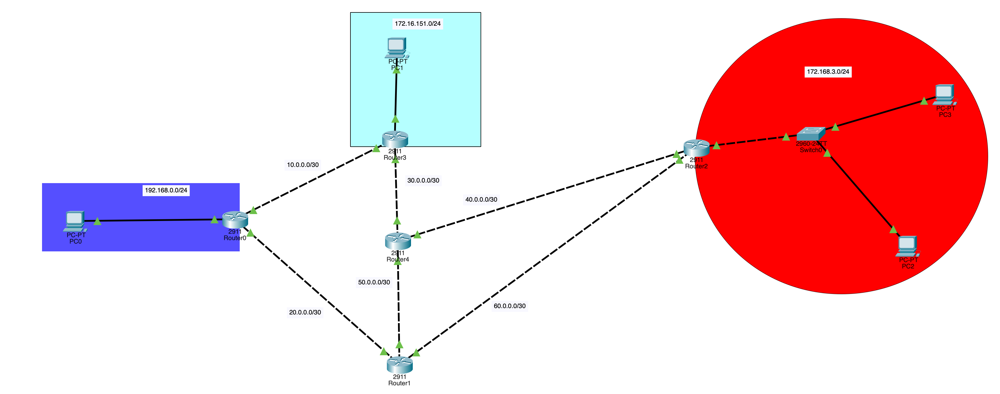

# OSPF Multi-Router Network

A Cisco Packet Tracer project connecting five routers, one switch, and four PCs across multiple remote networks, with end-to-end connectivity achieved entirely through **OSPF** dynamic routing.



## Overview

The goal was to build a more complex, multi-hop network — five routers, one switch, and four PCs — and get every device talking to every other device using OSPF rather than static routes. Point-to-point links between routers use a `/30` mask; local LANs use `/24`.

**Network layout:**

| Segment | Subnet | Devices |
|---|---|---|
| LAN behind Router0 | `192.168.0.0/24` | PC0 |
| LAN behind Router3 | `172.16.151.0/24` | PC1 |
| LAN behind Router2 (via Switch0) | `172.168.3.0/24` | PC2, PC3 |
| Router0 ↔ Router3 | `10.0.0.0/30` | point-to-point link |
| Router0 ↔ Router1 | `20.0.0.0/30` | point-to-point link |
| Router3 ↔ Router4 | `30.0.0.0/30` | point-to-point link |
| Router4 ↔ Router2 | `40.0.0.0/30` | point-to-point link |
| Router4 ↔ Router1 | `50.0.0.0/30` | point-to-point link |
| Router1 ↔ Router2 | `60.0.0.0/30` | point-to-point link |

Router1 and Router4 are pure **core/transit routers** — they carry no attached LAN, just backbone links connecting the edge routers (Router0, Router2, Router3) together.

## Objectives / Skills Demonstrated

- Multi-router topology design and structured IP addressing (`/24` LANs, `/30` point-to-point links)
- Dynamic routing with **OSPF** across a partially-meshed, multi-hop network
- Understanding how OSPF adjacencies form and how routers converge on a shared view of the topology
- End-to-end connectivity verification via `ping` across the whole network

## Configuration Walkthrough

### 1. Addressing
Each router was given a hostname (`R0`–`R4`). PCs were assigned static IPs and subnet masks, with each PC's default gateway set to its local router interface so it could reach hosts outside its own LAN. Router interfaces were addressed per the design spec above.

### 2. Dynamic Routing — OSPF
Every router was brought into OSPF process 1, advertising its directly connected networks with the appropriate wildcard mask:

```
router ospf 1
 network <network-ip> <wildcard-mask> area 0
```

- `/30` links → wildcard mask `0.0.0.3`
- `/24` networks → wildcard mask `0.0.0.255`

### 3. Verification
Ran `ping` from every PC to every other PC to confirm full connectivity across the network — including between PCs whose routers aren't directly connected to each other (e.g. PC0 behind Router0 reaching PC2/PC3 behind Router2).

## How OSPF Adjacency Formed

Once the `network` commands were applied, routers began sending Hello packets out their OSPF-enabled interfaces. This let directly connected neighbors (e.g. R0 with R3 and R1) discover each other and form adjacencies. From there, routers exchanged Link-State Advertisements (LSAs), so every router built a synchronized "map" of the entire topology — even for networks it wasn't directly connected to. That's what allows a device behind Router0 to reach a device behind Router2 despite there being no direct link between them: traffic is routed dynamically through the core (Router1/Router4).

## Files in This Folder

| File | Description |
|---|---|
| `ospf.pkt` | Cisco Packet Tracer topology file |
| `topology.png` | Network diagram |

## How to Open

1. Install [Cisco Packet Tracer](https://www.netacad.com/courses/packet-tracer) (free with a Cisco Networking Academy account).
2. Download `ospf.pkt` from this folder.
3. Open it directly in Packet Tracer to explore the topology and device configs.
