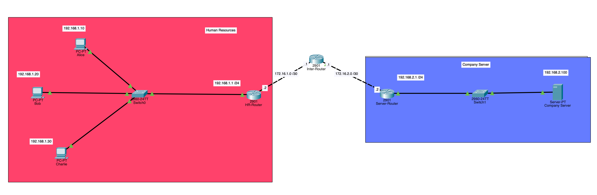

# Zone-Based Policy Firewall (ZPF)

A Cisco Packet Tracer project that converts a standard router into a **stateful firewall** using Cisco's Zone-Based Policy Firewall (ZPF) architecture, protecting a company server from unauthorized access.


*(add a screenshot of the full Packet Tracer topology here — see note at the bottom)*

## Overview

The goal of this project was to design a secure, controlled network that protects a **Company Server**, by turning a plain router (`ServerRouter`) into a stateful firewall rather than relying on basic ACLs alone.

**Network layout:**
- **Company Server** (`192.168.2.100`) sits behind `ServerRouter` on the `192.168.2.0/24` subnet (`Gi0/0`).
- `ServerRouter`'s other interface (`Gi0/1`, `172.16.2.2/30`) connects out toward `HR Router`.
- `HR Router` (`Gi0/1`, `192.168.1.1`) serves as the default gateway for the internal LAN (`192.168.1.0/24`), where three hosts live: **Alice** (`.10`), **Bob** (`.20`), and **Charlie** (`.30`).

All firewall configuration below is applied on `ServerRouter`.

## Objectives / Skills Demonstrated

- Router hardening: encrypted privileged access, SSH-only remote management
- Extended ACLs for granular, host-level traffic filtering
- Class-maps to group traffic of interest
- Policy-maps for **stateful inspection** (return traffic automatically permitted)
- Zone-Based Policy Firewall: security zones, zone-pairs, and interface zone-membership

## Configuration Walkthrough

### 1. Router Hardening & Remote Access
Set an encrypted privileged-mode password and enabled SSH-only remote administration.

```
enable secret <password>
username admin privilege 15 secret cisco123
crypto key generate rsa
line vty 0 4
```

### 2. Extended ACLs
Three ACLs identify the traffic the firewall needs to recognize:

```
ip access-list extended ACL-CHARLIE-HTTP
 permit tcp host 192.168.1.30 host 192.168.2.100 eq www

ip access-list extended ACL-ALICE-BOB-PING
 permit icmp host 192.168.1.10 host 192.168.2.100 echo
 permit icmp host 192.168.1.20 host 192.168.2.100 echo

ip access-list extended ACL-SSH-MGMT
 permit tcp any any eq 22
```

| ACL | Purpose |
|---|---|
| `ACL-CHARLIE-HTTP` | Only Charlie may reach the server over HTTP (TCP/80) |
| `ACL-ALICE-BOB-PING` | Only Alice and Bob may ping the server (ICMP echo) |
| `ACL-SSH-MGMT` | Permits SSH (TCP/22) for managing the router itself |

### 3. Class Maps
ACLs are grouped into class-maps so ZPF can apply stateful ("inspect") treatment to each group:

```
class-map type inspect match-any CM-CHARLIE
 match access-group name ACL-CHARLIE-HTTP
class-map type inspect match-any CM-ALICE-BOB
 match access-group name ACL-ALICE-BOB-PING
class-map type inspect match-any CM-SSH-MGMT
 match access-group name ACL-SSH-MGMT
class-map type inspect match-any CM-SERVER-OUT
 match protocol tcp
 match protocol udp
 match protocol icmp
```

Note there are 4 class-maps despite only 3 ACLs: `CM-SERVER-OUT` uses `match protocol` instead of an ACL, so it permits the server's outbound traffic based on protocol type (HTTP/ICMP) rather than a specific destination — since the server may need to respond to different clients.

### 4. Policy Maps
Policy-maps tell the router which class-maps to **inspect** (i.e., track statefully) and in which direction:

```
policy-map type inspect PM-EXT-TO-INT
 class type inspect CM-CHARLIE
  inspect
 class type inspect CM-ALICE-BOB
  inspect

policy-map type inspect PM-INT-TO-EXT
 class type inspect CM-SERVER-OUT
  inspect

policy-map type inspect PM-TO-SELF
 class type inspect CM-SSH-MGMT
  inspect
```

| Policy Map | Direction | Purpose |
|---|---|---|
| `PM-EXT-TO-INT` | Users → Server | Allow only Charlie (HTTP) and Alice/Bob (ping) in |
| `PM-INT-TO-EXT` | Server → Users | Allow the server's replies out, tracked statefully |
| `PM-TO-SELF` | → Router | Allow SSH to the router for management |

### 5. Security Zones
The network was split into two zones:
- **INTERNAL** — the Company Server side
- **EXTERNAL** — everyone else

### 6. Zone Activation
Zones and policies are tied to the physical interfaces, turning the router into an active firewall:

```
interface GigabitEthernet0/0
 ip address 192.168.2.1 255.255.255.0
 zone-member security INTERNAL

interface GigabitEthernet0/1
 ip address 172.16.2.2 255.255.255.252
 zone-member security EXTERNAL
```

## Result

| Source | Destination | Traffic | Allowed? |
|---|---|---|---|
| Charlie (192.168.1.30) | Server | HTTP (TCP/80) | ✅ |
| Alice (192.168.1.10) | Server | ICMP echo | ✅ |
| Bob (192.168.1.20) | Server | ICMP echo | ✅ |
| Any other host | Server | Anything | ❌ (implicit deny) |
| Server | External hosts | HTTP / ICMP replies | ✅ (stateful, session-tracked) |
| Any host | ServerRouter itself | SSH (TCP/22) | ✅ (management only) |

## Files in This Folder

| File | Description |
|---|---|
| `Level_5_Zone-Based_Policy_Firewall.pkt` | Cisco Packet Tracer topology file |
| `topology.png` | Network diagram screenshot *(add your own)* |

## How to Open

1. Install [Cisco Packet Tracer](https://www.netacad.com/courses/packet-tracer) (free with a Cisco Networking Academy account).
2. Download `Level_5_Zone-Based_Policy_Firewall.pkt` from this folder.
3. Open it directly in Packet Tracer to explore the topology and device configs.

